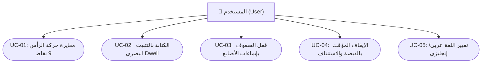

# 📋 وثيقة مواصفات متطلبات البرمجيات (SRS)
## Software Requirements Specification (SRS) Document
### وفق المعيار الدولي IEEE Std 830-1998 / ISO/IEC/IEEE 29148
### مشروع: نظام الكيبورد الافتراضي الذكي بتتبع الأنف وإيماءات اليد (Enterprise Edition v5.0)

---

## 📑 فهرس المحتويات
1. [المقدمة (Introduction)](#1-المقدمة)
   - 1.1 [الغرض من الوثيقة (Purpose)](#11-الغرض-من-الوثيقة)
   - 1.2 [نطاق النظام والمنتج (System Scope)](#12-نطاق-النظام-والمنتج)
   - 1.3 [المصطلحات والتعريفات والاختصارات (Definitions & Acronyms)](#13-المصطلحات-والتعريفات-والاختصارات)
   - 1.4 [المراجع المعيارية والأكاديمية (References)](#14-المراجع-المعيارية-والأكاديمية)
2. [الوصف العام للنظام (Overall Description)](#2-الوصف-العام-للنظام)
   - 2.1 [منظور المنتج ومخطط السياق (Product Perspective & Context)](#21-منظور-المنتج-ومخطط-السياق)
   - 2.2 [وظائف المنتج الرئيسية (Product Functions)](#22-وظائف-المنتج-الرئيسية)
   - 2.3 [فئات المستخدمين وخصائصهم (User Classes & Characteristics)](#23-فئات-المستخدمين-وخصائصهم)
   - 2.4 [بيئة التشغيل ومتطلبات العتاد (Operating Environment)](#24-بيئة-التشغيل-ومتطلبات-العتاد)
   - 2.5 [قيود التصميم والبرمجة (Design & Implementation Constraints)](#25-قيود-التصميم-والبرمجة)
   - 2.6 [الافتراضات والتبعيات (Assumptions & Dependencies)](#26-الافتراضات-والتبعيات)
3. [المتطلبات الوظيفية المفصلة (Specific Functional Requirements)](#3-المتطلبات-الوظيفية-المفصلة)
4. [متطلبات الواجهات الخارجية (External Interface Requirements)](#4-متطلبات-الواجهات-الخارجية)
5. [المتطلبات غير الوظيفية (Non-Functional Requirements - NFRs)](#5-المتطلبات-غير-الوظيفية)
6. [حالات الاستخدام ومخطط التفاعل (Use Case Specifications)](#6-حالات-الاستخدام-ومخطط-التفاعل)
7. [مصفوفة تتبع المتطلبات (Requirements Traceability Matrix - RTM)](#7-مصفوفة-تتبع-المتطلبات)

---

## 1. المقدمة

### 1.1 الغرض من الوثيقة (Purpose)
تهدف هذه الوثيقة إلى تقديم مواصفات هندسية دقيقة وشاملة لنظام **الكيبورد الافتراضي الذكي بتتبع الأنف وإيماءات اليد (v5.0)**، وتحديد كافة المتطلبات الوظيفية وغير الوظيفية والقيود التصميمية وفق معيار **IEEE 830**، لتكون مرجعاً رسمياً لمطوري النظام، ومقيمي المشاريع الأكاديمية، والمهندسين الطبيين.

### 1.2 نطاق النظام والمنتج (System Scope)
النظام عبارة عن تطبيق مكتبي تفاعلي ذكي يعمل في الزمن الحقيقي (**Real-Time Assistive Desktop System**)، يتيح للأفراد ذوي الإعاقة الحركية الكلية أو الجزئية (كالشلل الرباعي والتصلب الجانبي الضموري ALS) التحكم الكامل في مؤشر الفأرة والكتابة النصية عبر حركات الأنف الطبيعية وإيماءات اليد فقط عبر كاميرا الويب ودون الحاجة لأي حساسات إضافية.

### 1.3 المصطلحات والتعريفات والاختصارات (Definitions & Acronyms)

| المصطلح / الاختصار | المعنى والتعريف الهندسي |
| :--- | :--- |
| **HCI** | Human-Computer Interaction (التفاعل الإنساني الحاسوبي). |
| **DIP** | Digital Image Processing (معالجة الصور الرقمية). |
| **EAR** | Eye Aspect Ratio (مقياس نسبة فتحة العين لرصد الرمش والنعاس). |
| **FSM** | Finite State Machine (آلة الحالات المحدودة المستقرة). |
| **Deadband** | المنطقة الميتة الهندسية المانعة لارتعاش المؤشر (Laser Lock). |
| **Dwell Time** | زمن التثبيت المطلوب لتفعيل ضغطة المفتاح تلقائياً. |
| **WPM** | Words Per Minute (معدل سرعة الكتابة بالكلمات في الدقيقة). |
| **3NF** | Third Normal Form (المعيار القياسي الثالث لتصميم قواعد البيانات). |

### 1.4 المراجع المعيارية والأكاديمية (References)
1. معيار **IEEE Std 830-1998**: Recommended Practice for Software Requirements Specifications.
2. أبحاث **Google MediaPipe**: Real-time 3D Face and Hand Mesh Tracking on Mobile Devices (2020).
3. أبحاث **Casiez et al. (ACM CHI)**: 1€ Filter: A Simple Speed-based Low-pass Filter for Noisy Input in Interactive Systems.

---

## 2. الوصف العام للنظام

### 2.1 منظور المنتج ومخطط السياق (Product Perspective)
يعمل النظام كطبقة وسيطة مستقلة بين مدخلات كاميرا الويب وتطبيقات نظام التشغيل:

```mermaid
flowchart LR
    User["👤 المستخدم (Patient / User)"] -->|حركات الأنف وإيماءات اليد| WebCam["📷 كاميرا الويب (Hardware)"]
    WebCam -->|Video Stream (30 FPS)| System["🧠 نظام الكيبورد البصري الذكي v5.0\n(Smart Gaze Keyboard Engine)"]
    System -->|Virtual Keypress Events| OS["💻 نظام التشغيل والتطبيقات (OS Apps)"]
    System -->|Visual & Audio Feedback| User
    System <-->|Calibration & Analytics| Database[("🗄️ قاعدة البيانات والتهيئة")]
```

### 2.2 وظائف المنتج الرئيسية (Product Functions)
1. **التحكم بمؤشر الشاشة عبر الأنف:** استخدام طرف الأنف كمؤشر ليزري فائق الدقة.
2. **المعايرة الهندسية 9 نقاط:** حل مصفوفة التحويل التآلفي لمطابقة مجال حركة الرأس مع أبعاد الشاشة.
3. **تثبيت الكتابة الزمني (Circular Dwell):** الضغط على المفاتيح بمجرد التثبيت البصري لدائرة محددة زمنياً.
4. **التحكم بالإيماءات اليدوية:** إيقاف مؤقت بالقبضة، استئناف بالكف، وقفل الصفوف بالأصابع.
5. **السلامة الفسيولوجية ومراقبة الرمش:** حجب الكتابة أثناء الرمش الطبيعي أو النعاس (EAR).
6. **التجميد الاحتياطي الآمن (Safe Freeze):** منع الضغط العشوائي عند فقدان الوجه.

### 2.3 فئات المستخدمين وخصائصهم (User Classes)
- **المستخدمون ذوو الإعاقات الحركية الشديدة (Primary End-Users):** يحتاجون لواجهة واضحة، أزرار عريضة، وثبات مطلق للمؤشر دون إجهاد الرقبة.
- **الأطباء والمشرفون الصحيون (Clinicians & Supervisors):** يحتاجون لمتابعة مقاييس الأداء، وسرعة الكتابة، وتقارير الإجهاد.
- **الباحثون والمهندسون (Academic Evaluators):** يحتاجون لتحليل دقة المعايرة ومصفوفات التحويل.

### 2.4 بيئة التشغيل ومتطلبات العتاد
- **نظام التشغيل:** Windows 10/11, Linux, macOS.
- **المعالج:** Intel Core i3 أو AMD Ryzen 3 فما فوق.
- **الذاكرة العشوائية:** 4 GB RAM كحد أدنى (النظام يستهلك أقل من 250 MB).
- **الكاميرا:** كاميرا ويب عادية بدقة 720p بمعدل 30 إطاراً في الثانية.

---

## 3. المتطلبات الوظيفية المفصلة (Functional Requirements)

### 📌 [FR-01] التقاط إطارات الفيديو في الزمن الحقيقي
* **الوصف:** يجب على النظام الاتصال بكاميرا الويب والتقاط الإطارات بمعدل لا يقل عن 30 إطاراً بالثانية دون انقطاع.
* **المدخلات:** كاميرا رقمية (Device Index 0).
* **المخرجات:** مصفوفات صور رقمية (BGR/RGB Arrays).

### 📌 [FR-02] الكشف وتتبع طرف الأنف ثلاثي الأبعاد
* **الوصف:** يجب على محرك الرؤية استخراج إحداثيات طرف الأنف ثلاثية الأبعاد (Landmarks #1 و #4) بدقة بكسلية عالية.
* **شروط البدء:** وجود وجه داخل إطار الكاميرا.
* **المخرجات:** إحداثيات نورمالايزد `(nose_x, nose_y)` بنطاق $[0.0 - 1.0]$.

### 📌 [FR-03] الكشف عن إيماءات اليد وتصنيفها
* **الوصف:** يجب على النظام تصنيف 5 إيماءات رئيسية: قبضة اليد (`FIST`)، كف اليد المفتوح (`OPEN_PALM`)، وعدد الأصابع المرفوعة من 1 إلى 4.
* **زمن التأكيد:** تطبيق مهلة استقرار زمني لا تقل عن $0.35\text{ ثانية}$ لمنع الانتقالات العشوائية.

### 📌 [FR-04] قياس نسبة انفتاح العين واكتشاف الرمش (EAR)
* **الوصف:** يجب حساب نسبة $EAR$ لكلتا العينين. إذا انخفضت عن العتبة القياسية ($EAR < 0.16$)، يتم إيقاف عداد التثبيت لمنع الإدخال الخاطئ أثناء الرمش.

### 📌 [FR-05] المعايرة التفاعلية الهندسية 9 نقاط
* **الوصف:** توفير واجهة تفاعلية تعرض 9 نقاط مرجعية على الشاشة ($3 \times 3$)، وتجميع عينات حركة الرأس، وحل مصفوفة التحويل التآلفي ($2 \times 3$ Affine Matrix) بالمربعات الصغرى.
* **القاعدة الهندسية الصارمة:** أثناء المعايرة، يتم حجب وتجاهل جميع إيماءات اليد لمنع أي تعارض.

### 📌 [FR-06] القفل الليزري في المنطقة الميتة الصارمة (Strict Deadband)
* **الوصف:** إذا كانت إزاحة الرأس اللحظية أقل من أو تساوي $1.8\text{ بكسل}$، يجب تثبيت المؤشر في مكانه بنسبة ارتعاش صفرية مطلقاً ($0\%\text{ Jitter}$).

### 📌 [FR-07] التنعيم التدريجي المتصل بحبل الحركة (Continuous Leash Easing)
* **الوصف:** عند تحريك الرأس بسرعة، يجب تطبيق تنعيم فيزيائي تكيفي يزيد من سرعة المؤشر تدريجياً لمنع التأخير المطاطي (Zero Lagging).

### 📌 [FR-08] إدارة حالات النظام (Latching State Machine)
* **الوصف:** إدارة الانتقال بين الحالات الخمس (`ACTIVE`, `PAUSED`, `CALIBRATING`, `ROW_LOCKED`, `SAFE_FREEZE`) مع حماية كاملة من التضارب.

### 📌 [FR-09] التثبيت الزمني الدائري والكتابة (Circular Dwell)
* **الوصف:** عند استقرار المؤشر فوق زر لمدة زمنية محددة (افتراضياً $0.85\text{ ثانية}$)، تكتمل حلقة التحميل الدائرية بنسبة $100\%$ ويُطلق حدث كتابة الحرف، مع إصدار صوت نقر ناعم وتحديث مقياس $WPM$.

### 📌 [FR-10] التجميد الاحتياطي الآمن (Safe Freeze)
* **الوصف:** فور انقطاع إشارة الوجه أو تعطل الكاميرا، يتم تجميد المؤشر وتعطيل الكتابة لحين استعادة الرؤية.

### 📌 [FR-11] تخزين واسترجاع إعدادات المعايرة
* **الوصف:** حفظ معاملات المعايرة ومصفوفة التحويل في `config/calibration.json` واسترجاعها تلقائياً عند التشغيل.

---

## 4. متطلبات الواجهات الخارجية (External Interfaces)

### 4.1 واجهة المستخدم الرسومية (GUI)
- واجهة مستخدم مظلمة فاخرة (Modern Dark Glassmorphism).
- كانفاس عالي التردد لرسم مؤشر الليزر المتوهج وحلقة التثبيت الدائرية.
- نافذة عرض الكاميرا المصغرة (PIP Window) لمراقبة وضعية الوجه.

### 4.2 واجهات العتاد (Hardware)
- كاميرا ويب قياسية (USB / Integrated Webcam).
- مكبر الصوت المدمج للتغذية الصوتية (Audio Clicks).

### 4.3 واجهات البرمجيات (Software)
- MediaPipe Tasks C++ Vision Core.
- نظام التشغيل Windows API / X11 لأحداث لوحة المفاتيح.

---

## 5. المتطلبات غير الوظيفية (Non-Functional Requirements)

```
+-------------------------------------------------------------------------+
|                  المعايير الهندسية غير الوظيفية (NFRs)                  |
+-------------------------------------------------------------------------+
| [NFR-01] زمن الاستجابة (Latency): زمن معالجة الإطار <= 33ms (30-60 FPS)  |
| [NFR-02] استهلاك الموارد: المعالج CPU < 15% ، الذاكرة RAM < 250 MB      |
| [NFR-03] السلامة والراحة: زوايا إمالة الرأس المريحة <= 15 درجة          |
| [NFR-04] الموثوقية: عدم الانهيار التام (Zero Unhandled Exceptions)      |
| [NFR-05] التوافقية: دعم الشاشات بدقة HD, Full HD, 2K, 4K                |
+-------------------------------------------------------------------------+
```

---

## 6. حالات الاستخدام ومخطط التفاعل (Use Cases)



---

## 7. مصفوفة تتبع المتطلبات (Requirements Traceability Matrix - RTM)

| معرف المتطلب | اسم المتطلب الوظيفي | الوحدة البرمجية المسؤولة | ملفات الاختبار وضمان الجودة |
| :--- | :--- | :--- | :--- |
| **FR-01** | التقاط إطارات الكاميرا | `backend/tracking_engine.py` | `tests/test_virtual_keyboard.py` |
| **FR-02** | تتبع طرف الأنف | `backend/tracking_engine.py` | `TestNosePointerAlgorithm` |
| **FR-03** | تصنيف إيماءات اليد | `backend/tracking_engine.py` | `TestStateMachine` |
| **FR-04** | مقياس انفتاح العين EAR | `backend/core_math.py` | `TestCoreMath.test_calculate_ear` |
| **FR-05** | المعايرة التآلفية 9 نقاط | `frontend/calibration_ui.py` | `TestCoreMath.test_affine_transform` |
| **FR-06** | القفل الليزري في المنطقة الميتة | `backend/core_math.py` | `TestCoreMath.test_deadband` |
| **FR-07** | التنعيم المتصل بحبل الحركة | `backend/core_math.py` | `TestCoreMath.test_leash_easing` |
| **FR-08** | إدارة آلة الحالات FSM | `backend/state_machine.py` | `TestStateMachine.test_latching` |
| **FR-09** | التثبيت الزمني والكتابة | `frontend/gaze_keyboard.py` | `TestStateMachine.can_dwell` |
| **FR-10** | التجميد الآمن عند فقدان الوجه | `backend/state_machine.py` | `TestStateMachine.test_safe_freeze` |
| **FR-11** | حفظ المعايرة في JSON | `backend/tracking_engine.py` | `TestTrackingEngine.load_calib` |
