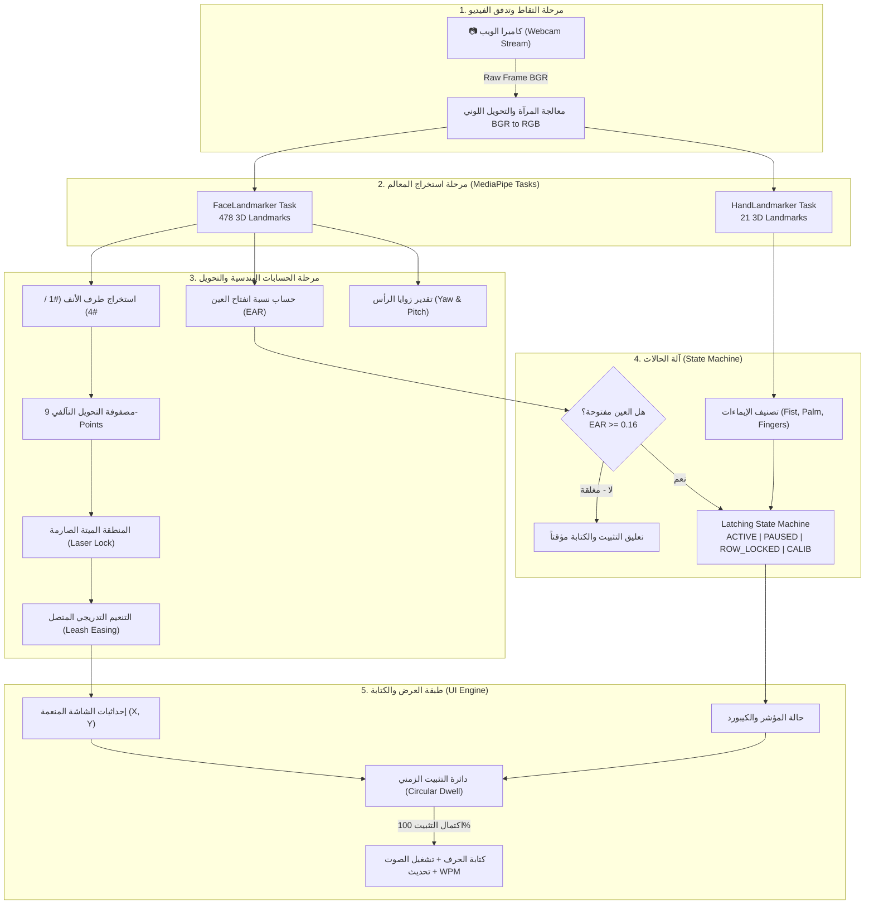

# 🏛️ وثيقة التصميم المعماري والهندسي الشامل للمنظومة
## Comprehensive System Architecture & Engineering Specification
### مشروع: نظام الكيبورد البصري الذكي للتحكم بالرأس وتتبع الأنف وإيماءات اليد (Enterprise v5.0)

---

## 📑 فهرس المحتويات
1. [المقدمة والرؤية الهندسية (Introduction & Engineering Vision)](#1-المقدمة-والرؤية-الهندسية)
2. [الهيكلية المعمارية وفصل الاهتمامات (Layered Architecture & SoC)](#2-الهيكلية-المعمارية-وفصل-الاهتمامات)
3. [خط أنابيب المعالجة من النهاية للنهاية (End-to-End Processing Pipeline)](#3-خط-أنابيب-المعالجة-من-النهاية-للنهاية)
4. [الخوارزميات والمعادلات الرياضية الأساسية (Core Algorithms & Math)](#4-الخوارزميات-والمعادلات-الرياضية-الأساسية)
5. [آلة الحالات المستقرة زمنياً (Latching State Machine)](#5-آلة-الحالات-المستقرة-زمنياً)
6. [إدارة التزامن وتعدد الخيوط (Concurrency & Multi-Threading)](#6-إدارة-التزامن-وتعدد-الخيوط)
7. [معمارية تخزين البيانات وقاعدة البيانات (Data Architecture & ERD)](#7-معمارية-تخزين-البيانات-وقاعدة-البيانات)
8. [إيماءات اليد واختصارات التحكم (Hand Gestures & Controls)](#8-إيماءات-اليد-واختصارات-التحكم)
9. [استراتيجيات الأمان والتعافي من الأخطاء (Fail-Safe & Fault Tolerance)](#9-استراتيجيات-الأمان-والتعافي-من-الأخطاء)

---

## 1. المقدمة والرؤية الهندسية

يمثل نظام الكيبورد البصري الذكي (**Enterprise Virtual Keyboard v5.0**) نقلة نوعية في مجال أنظمة التفاعل الإنساني الحاسوبي المساعد (**Assistive HCI**)، حيث صُمم لتمكين الأشخاص ذوي الإعاقات الحركية الشديدة (مثل مرضى التصلب الجانبي الضموري **ALS** ومصابي الشلل الرباعي **Tetraplegia**) من الكتابة والتحكم الكامل في الحاسوب باستخدام حركات الرأس الخفيفة وطرف الأنف فقط، مع دعم إيماءات اليد للأشخاص القادرين على تحريك اليد.

تم بناء النظام بالكامل وفق أعلى معايير هندسة البرمجيات:
- **فصل الاهتمامات (Separation of Concerns):** استقلالية تامة بين الحسابات الرياضية، محرك الرؤية، آلة الحالات، وواجهة المستخدم.
- **تزامن متعدد الخيوط بدون تجميد (Zero-Lag Multi-threaded Pipeline).**
- **ثبات مطلق للمؤشر فوق المفاتيح (Strict Deadband Laser Lock).**
- **معايرة هندسية فائقة الدقة عبر مصفوفة التحويل التآلفي (9-Point Affine Transformation).**

---

## 2. الهيكلية المعمارية وفصل الاهتمامات

تم تقسيم المشروع إلى طبقات برمجية محكمة ومترابطة تحقق أعلى درجات التماسك (High Cohesion) وأقل درجات الاعتمادية (Low Coupling):

```
project_DIP_1_1/
│
├── main.py                     # نقطة الدخول الرئيسية للنظام (Main Entry Point)
├── requirements.txt            # قائمة التبعيات والمكتبات
├── README.md                   # دليل البدء السريع
│
├── backend/                    # الطبقة الخلفية ومحركات الرؤية والحسابات
│   ├── __init__.py
│   ├── core_math.py            # الحسابات الرياضية الصرفة والتحويلات الهندسية (Pure Math)
│   ├── state_machine.py        # آلة الحالات المستقرة زمنياً (Latching State Machine)
│   ├── tracking_engine.py      # محرك الرؤية وتتبع المعالم (MediaPipe Vision Tracker)
│   └── database_schema.sql     # سكريبت DDL لقاعدة البيانات العلائقية 3NF
│
├── frontend/                   # الطبقة الأمامية وواجهات المستخدم الرسومية
│   ├── __init__.py
│   ├── gaze_keyboard.py        # واجهة الكيبورد المظلمة والمؤشر الليزري (Main GUI)
│   └── calibration_ui.py       # نافذة المعايرة الهندسية 9 نقاط (Calibration Window)
│
├── models/                     # نماذج الذكاء الاصطناعي المدربة مسبقاً
│   ├── face_landmarker.task    # نموذج شبكة معالم الوجه (478 نقطة ثلاثية الأبعاد)
│   └── hand_landmarker.task    # نموذج شبكة معالم اليد (21 مفصلاً ثلاثي الأبعاد)
│
├── config/                     # ملفات الإعدادات والبيانات المحلية
│   └── calibration.json        # المعاملات المحفوظة ومصفوفة التحويل
│
├── tests/                      # حزمة اختبارات الجودة الأكاديمية
│   ├── __init__.py
│   └── test_virtual_keyboard.py # 12 اختبار وحدة شاملاً (Unit Tests)
│
├── docs/                       # وثائق النظام والمتطلبات
│   ├── TOOLS.md                # دليل الأدوات والتقنيات البرمجية
│   ├── SYSTEM_DOCUMENTATION.md # الوثيقة الهندسية والمعمارية الشاملة
│   └── SRS.md                  # مواصفات متطلبات البرمجيات (IEEE 830)
│
└── reports/                    # التقارير الأكاديمية الفاخرة والعروض التقديمية
    ├── scripts/                # مولدات التقارير الآلية
    │   ├── build_luxury_pdf_report.py
    │   ├── generate_academic_documentation.py
    │   └── generate_database_specification_pdf.py
    ├── Academic_Engineering_Documentation_Gaze_Keyboard.pdf
    ├── Academic_Presentation_Gaze_Keyboard.pptx
    └── Database_Architecture_And_Engineering_Specification.pdf
```

---

## 3. خط أنابيب المعالجة من النهاية للنهاية



---

## 4. الخوارزميات والمعادلات الرياضية الأساسية

### أ. خوارزمية المنطقة الميتة الصارمة والتنعيم التدريجي المتصل (Strict Deadband & Continuous Leash Easing)
تمنع هذه الخوارزمية الاهتزاز الفسيولوجي الميكروسكوبي الدقيق للرأس عند محاولة تثبيت المؤشر فوق زر معين:

1. **حساب المسافة الإقليدية للإزاحة اللحظية:**
   $$d = \sqrt{(x_{\text{target}} - x_{\text{smooth}})^2 + (y_{\text{target}} - y_{\text{smooth}})^2}$$

2. **قاعدة القفل الليزري الصارم (Laser Lock):**
   $$\text{إذا كان } d \le \text{Deadband} \implies P_{\text{smooth}}^{(t)} = P_{\text{smooth}}^{(t-1)} \quad (\text{ثبات تام بنسبة ارتعاش 0\%})$$

3. **التنعيم التدريجي المتصل (عند تخطي المنطقة الميتة $d > \text{Deadband}$):**
   $$d_{\text{excess}} = d - \text{Deadband}, \quad \text{ratio} = \frac{d_{\text{excess}}}{d}$$
   $$\alpha = 0.30 + 0.62 \times \left(\min\left(1.0, \frac{d_{\text{excess}}}{\text{Leash}}\right)\right)^{1.35}$$
   $$P_{\text{smooth}}^{(t)} = P_{\text{smooth}}^{(t-1)} + \Delta P \cdot \text{ratio} \cdot \alpha$$

---

### ب. مصفوفة التحويل التآلفي 9 نقاط (9-Point Affine Transformation Matrix)
لتحويل إحداثيات حركة الأنف الطبيعية من فضاء الكاميرا إلى فضاء الشاشة والكيبورد دون أي تشوه:

$$\begin{bmatrix} u \\ v \end{bmatrix} = \begin{bmatrix} a_1 & a_2 & a_3 \\ b_1 & b_2 & b_3 \end{bmatrix} \begin{bmatrix} x \\ y \\ 1 \end{bmatrix}$$

تُحل المعادلة بطريقة المربعات الصغرى (**Least Squares Matrix Solver**) على عينات المعايرة التسع:
$$M \cdot A = U, \quad M \cdot B = V$$

---

### ج. مقياس نسبة انفتاح العين (Eye Aspect Ratio - EAR)
لحماية المستخدم من الضغط الخاطئ أثناء الرمش الطبيعي أو النعاس:

$$EAR = \frac{||p_{160} - p_{144}|| + ||p_{158} - p_{153}||}{2 \times ||p_{33} - p_{133}||}$$

- إذا كان $EAR < 0.16$: تُعتبر العين مغلقة، ويتم تجميد عداد التثبيت (Dwell Timer) فوراً.

---

## 5. آلة الحالات المستقرة زمنياً (Latching State Machine)

تتحكم آلة الحالات في 5 حالات رئيسية تمنع أي تضارب بين الإيماءات وحركات المؤشر:

| الحالة (State) | الوصف الهندسي | إمكانية حركة المؤشر | إمكانية التثبيت والكتابة |
| :--- | :--- | :---: | :---: |
| **`ACTIVE`** | الحالة الطبيعية للكتابة والتتبع الحر. | ✅ نعم | ✅ نعم |
| **`PAUSED`** | إيقاف مؤقت بقبضة اليد أو إغلاق العين. | ❌ لا | ❌ لا |
| **`CALIBRATING`** | جلسة المعايرة (حجب صارم لجميع الإيماءات). | ✅ نعم (فقط للنقاط) | ❌ لا |
| **`ROW_LOCKED`** | قفل المحور الرأسي على صف معين للكتابة السريعة. | ✅ نعم (أفقي فقط) | ✅ نعم |
| **`SAFE_FREEZE`** | تجميد أمان احتياطي عند فقدان الوجه. | ❌ لا | ❌ لا |

---

## 6. إدارة التزامن وتعدد الخيوط (Concurrency & Multi-Threading)

لتحقيق أداء سلس لا ينخفض عن 60 إطاراً في الثانية:
1. **خيط الرؤية الخلفي (Background Vision Thread):**
   - يعمل بحلقة لا نهائية بمعدل 30-60 إطاراً في الثانية.
   - يستقبل الإطارات، يستخرج معالم الوجه واليد، ويحسب المعادلات.
   - يُحدّث كائن `TrackingResult` المحمي بـ `threading.Lock`.
2. **خيط واجهة المستخدم الرئيسي (Tkinter Main GUI Thread):**
   - ينبض كل 16 ملي ثانية (60 FPS) عبر `root.after(16, self._render_loop)`.
   - يقرأ بأمان الإحداثيات المنعمة، يرسم المؤشر وحلقة التثبيت، ويطلق أحداث لوحة المفاتيح.

---

## 7. معمارية تخزين البيانات وقاعدة البيانات

تتبع المنظومة معمارية هجينة موثوقة:
1. **ذاكرة الكاش اللحظية (`config/calibration.json`):**
   - تخزين إعدادات المعايرة النشطة والمنطقة الميتة لسرعة قراءة بزمن 0ms.
2. **قاعدة البيانات العلائقية (`backend/database_schema.sql`):**
   - مطابقة للمعيار القياسي **3NF** لإدارة ملفات المستخدمين، جلسات الكتابة، ومقاييس السرعة والأمان الفسيولوجي.

---

## 8. إيماءات اليد واختصارات التحكم

| الإيماءة | الكود المصنف | الوظيفة البرمجية |
| :--- | :--- | :--- |
| **✊ قبضة اليد (Fist)** | `FIST` | تجميد الكيبورد وإيقافه مؤقتاً (`PAUSED`) |
| **✋ كف اليد المفتوح (Palm)** | `OPEN_PALM` | استئناف التتبع الفوري أو فك قفل الصف |
| **☝️ إصبع واحد مرفوع** | `FINGER_1` | قفل الصف العلوي أفقياً |
| **✌️ إصبعان مرفوعان** | `FINGER_2` | قفل الصف الأوسط أفقياً |
| **🤟 ثلاثة أصابع مرفوعة** | `FINGER_3` | قفل الصف السفلي أفقياً |
| **🖖 أربعة أصابع مرفوعة** | `FINGER_4` | قفل صف المسافة والتحكم أفقياً |

---

## 9. استراتيجيات الأمان والتعافي من الأخطاء (Fail-Safe)

1. **آلية التجميد الآمن (Safe Freeze):** فور حجب الكاميرا أو غياب الوجه، يتجمد المؤشر في مكانه فوراً دون الضغط على أي زر عشوائي.
2. **إعادة المحاذاة التلقائية للمعايرة:** في حال تلف ملف `calibration.json`، يبدأ النظام تلقائياً بمعاملات افتراضية آمنة تضمن استمرار العمل دون انهيار.
3. **تنزيل النماذج الآلي (Self-Healing Model Downloader):** إذا فُقدت ملفات `.task`، يقوم النظام بتنزيلها تلقائياً من خوادم Google الرسمية وتفعيل الوضع البديل (Fallback) لحين اكتمال التحميل.
